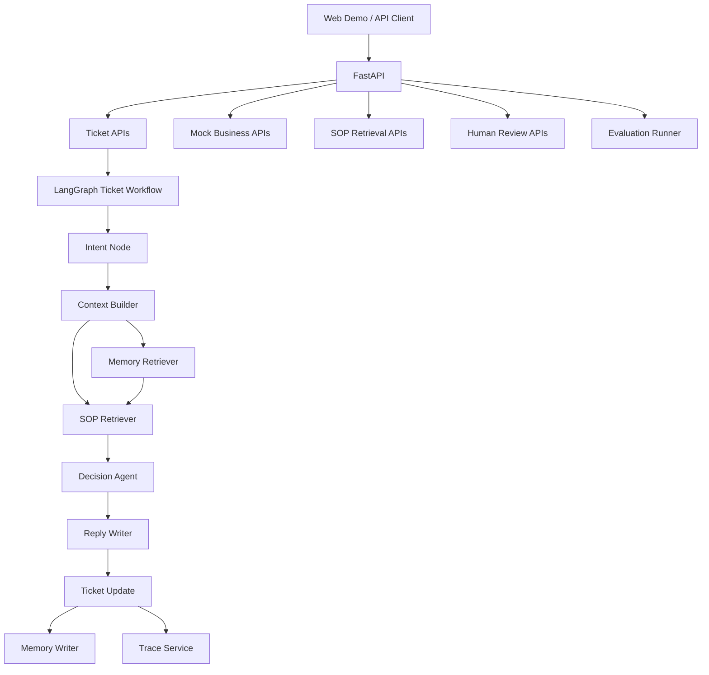

# Support SOP Agent

[English](./README.en.md) | [中文](./README.zh-CN.md)

Support SOP Agent is an open-source customer support workflow Agent. It follows SOP documents, calls mock business tools, routes risky tickets to human review, records execution traces, and runs regression evaluations.

This is not a generic chatbot. It is a practical business Agent template for real ticket workflows.

## What It Does

The project currently supports these demo scenarios:

- Shipped order refund
- High-value refund requiring human review
- Logistics tracking with no recent update
- Invoice reissue with missing required fields

For each ticket, the workflow can:

1. Classify the ticket intent.
2. Load order, logistics, user, and ticket history context.
3. Retrieve relevant SOP policy sections.
4. Make a structured decision.
5. Generate a customer-facing reply.
6. Save an execution trace.
7. Route high-risk cases to human review.
8. Retrieve and write user-level memories.
9. Run YAML-based regression evaluations.

## Architecture



Workflow nodes:

```text
intent_agent -> context_builder -> memory_retriever -> sop_retriever -> decision_agent -> reply_writer -> ticket_update
```

## Tech Stack

- Backend: FastAPI
- Frontend: React + Vite
- Agent workflow: LangGraph
- SOP retrieval: Markdown policy loader + SQLite-persisted vector hybrid retrieval
- Memory: SQLite persistence with semantic, episodic, and procedural scopes
- Storage: SQLite for vector and memory data; ticket services remain in memory
- Evaluation: YAML cases + Python runner
- DevOps: Docker Compose

## Project Structure

```text
support-sop-agent/
  apps/
    api/
      app/
        agents/
        routes/
        schemas/
        services/
      tests/
    web/
      src/
  knowledge_base/
  evals/
    cases/
    run.py
  examples/
  README.md
  README.en.md
  README.zh-CN.md
  docker-compose.yml
```

## Quick Start With Docker

Requirements:

- Docker
- Docker Compose

Run:

```bash
cp .env.example .env
docker compose up --build
```

Open:

```text
Web UI:   http://localhost:3000
API docs: http://localhost:8000/docs
Health:   http://localhost:8000/health
```

In the web UI:

1. Choose a scenario.
2. Create a ticket.
3. Run the Agent.
4. Inspect the decision, final reply, and trace.
5. For high-value refund, handle the pending human review.

## Windows EXE Packaging

You can package the backend API and SOP knowledge base into a Windows executable.

Requirements:

- Python 3.12
- Windows PowerShell

Build:

```powershell
.\scripts\build_windows_exe.ps1
```

Output:

```text
dist\support-sop-agent.exe
dist\support-sop-agent-v0.1.1-windows-x64-lite.zip
```

Run:

```powershell
.\dist\support-sop-agent.exe
```

The executable starts the FastAPI backend and opens:

```text
http://127.0.0.1:8000/docs
```

Notes:

- This EXE packages the backend API and SOP documents.
- The packaging script also creates a lite zip that is small enough for 25 MB upload limits.
- The React web UI is not embedded yet. To use the web UI, run it separately with `npm run dev` or Docker Compose.
- You can change host or port with `SUPPORT_SOP_HOST` and `SUPPORT_SOP_PORT`.

## Local Development

### Backend

Requirements:

- Python 3.12

Install dependencies:

```bash
cd apps/api
py -3.12 -m pip install -r requirements.txt
```

Run the API:

```bash
py -3.12 -m uvicorn app.main:app --reload --host 0.0.0.0 --port 8000
```

Open:

```text
http://localhost:8000/docs
```

Run tests:

```bash
cd apps/api
py -3.12 -m pytest tests
```

### Frontend

Requirements:

- Node.js 20+
- npm

Install dependencies:

```bash
cd apps/web
npm install
```

Run the web app:

```bash
npm run dev
```

Open:

```text
http://localhost:3000
```

Build:

```bash
npm run build
```

The Vite dev server proxies API requests to `http://localhost:8000` by default. In Docker, `VITE_API_TARGET=http://api:8000` is configured in `docker-compose.yml`.

## API Examples

### Create a ticket

```bash
curl -X POST http://localhost:8000/api/tickets \
  -H "Content-Type: application/json" \
  -d "{\"user_id\":\"U1001\",\"order_id\":\"OD2026001\",\"message\":\"我买的耳机已经发货了，但是我现在不想要了，帮我退款。\"}"
```

### Run the Agent workflow

```bash
curl -X POST http://localhost:8000/api/tickets/T00000001/run
```

### Read the latest trace

```bash
curl http://localhost:8000/api/tickets/T00000001/trace
```

### Search SOP documents

```bash
curl -X POST http://localhost:8000/api/sops/search \
  -H "Content-Type: application/json" \
  -d "{\"query\":\"shipped order direct refund\",\"policy_type\":\"refund\",\"top_k\":2}"
```

### List pending human reviews

```bash
curl http://localhost:8000/api/reviews/pending
```

### Submit a review

```bash
curl -X POST http://localhost:8000/api/reviews/T00000001 \
  -H "Content-Type: application/json" \
  -d "{\"action\":\"edit\",\"final_reply\":\"Your request has been reviewed and will be handled by support.\",\"comment\":\"Adjusted wording.\"}"
```

## API Overview

Ticket APIs:

```text
POST  /api/tickets
GET   /api/tickets
GET   /api/tickets/{ticket_id}
PATCH /api/tickets/{ticket_id}
POST  /api/tickets/{ticket_id}/run
GET   /api/tickets/{ticket_id}/trace
GET   /api/tickets/{ticket_id}/traces
```

SOP APIs:

```text
GET  /api/sops
POST /api/sops/reindex
POST /api/sops/search
```

The SOP RAG pipeline includes:

- Markdown heading-based chunking
  - configurable embedding providers (local deterministic hash or OpenAI-compatible API)
  - SQLite-persisted vector index with restart recovery
- in-memory vector store
- metadata filtering by `policy_type`
- vector similarity search
- keyword overlap scoring
- hybrid ranking
- source and section citations

Review APIs:

```text
GET  /api/reviews/pending
POST /api/reviews/{ticket_id}
GET  /api/reviews/{ticket_id}
```

Memory APIs:

```text
GET  /api/memory/users/{user_id}
POST /api/memory
POST /api/memory/retrieve
DELETE /api/memory/{memory_id}
```

Mock business APIs:

```text
GET  /mock/orders/{order_id}
GET  /mock/logistics/{order_id}
GET  /mock/users/{user_id}
GET  /mock/users/{user_id}/tickets
POST /mock/escalations
```

Tool audit API:

```text
GET /api/tools/audits
GET /api/tools/audits?tool_name=create_escalation&status=success
```

## Seed Data

Useful order IDs:

```text
OD2026001: shipped refund scenario
OD2026002: unshipped refund scenario
OD2026003: high-value refund scenario
OD2026004: logistics no-update scenario
OD2026005: invoice reissue scenario
```

Useful user IDs:

```text
U1001: normal user
U1003: VIP user
U1005: enterprise user
```

## Evaluation

Run all evaluation cases:

```bash
py -3.12 -m evals.run
```

The runner:

- loads YAML cases from `evals/cases`
- creates a ticket
- runs the Agent workflow
- checks intent, status, risk level, decision, reply constraints, and trace nodes
- writes a JSON report to `evals/report.json`

Expected output:

```text
{"total": 4, "passed": 4, "failed": 0}
```

Run backend tests:

```bash
cd apps/api
py -3.12 -m pytest tests
```

## Current Status

Implemented:

- Repository skeleton
- FastAPI backend
- React/Vite web demo
- Mock business APIs
- Ticket CRUD APIs
- Markdown SOP loading and vector hybrid retrieval
- LangGraph ticket workflow
- Trace persistence and query APIs
- Human review workflow
- User memory retrieval and workflow outcome writing
- YAML evaluation runner

Not yet implemented:

- Persistent database storage
- Persistent vector database such as Chroma, Qdrant, or pgvector
- Real LLM integration
- Real CRM/order/logistics integrations
- Authentication and multi-tenant support

## Troubleshooting

### `py` is not available

Use `python` instead:

```bash
python -m pip install -r apps/api/requirements.txt
python -m uvicorn app.main:app --reload --app-dir apps/api
```

### `node` or `npm` is not available

Install Node.js 20+ and restart your terminal.

### Frontend cannot reach backend

Make sure the backend is running at:

```text
http://localhost:8000
```

For Docker, keep this environment variable in `docker-compose.yml`:

```text
VITE_API_TARGET=http://api:8000
```

### Trace endpoint returns 404

Run the Agent first:

```text
POST /api/tickets/{ticket_id}/run
```

Trace is created after workflow execution.

## Roadmap

- Add SQLite/PostgreSQL persistence
- Scale the current SQLite vector index to Qdrant or pgvector
- Add BM25 and a reranker for more demanding SOP retrieval
- Add real LLM prompt nodes
- Extend lightweight relevance retrieval with vector memory and summarization
- Add authentication
- Add OpenTelemetry or LangSmith tracing
- Add GitHub Actions for tests and evals
- Add screenshots and demo GIF
