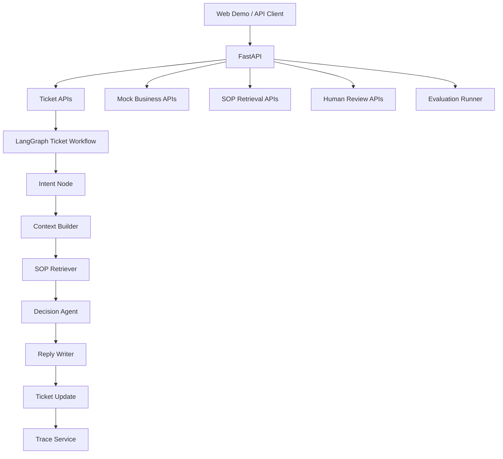

# Support SOP Agent

[English](./README.en.md) | [中文](./README.zh-CN.md)

Support SOP Agent 是一个开源客服工单工作流 Agent。它可以基于 SOP 文档进行检索，调用 Mock 业务工具，把高风险工单转入人工审核，记录 Agent 执行轨迹，并通过 YAML 用例进行回归评估。

它不是一个普通聊天机器人，而是一个面向真实客服工单流程的业务 Agent 模板。

## 项目能力

当前 Demo 支持这些场景：

- 已发货订单申请退款
- 高金额退款进入人工审核
- 物流长时间未更新
- 发票重开且需要补充字段

每个工单会经过：

1. 识别工单意图。
2. 加载订单、物流、用户、历史工单上下文。
3. 检索相关 SOP 条款。
4. 生成结构化决策。
5. 生成面向客户的回复。
6. 保存执行轨迹。
7. 将高风险工单转入人工审核。
8. 通过 YAML 用例进行回归评估。

## 架构



工作流节点：

```text
intent_agent -> context_builder -> sop_retriever -> decision_agent -> reply_writer -> ticket_update
```

## 技术栈

- Backend: FastAPI
- Frontend: React + Vite
- Agent workflow: LangGraph
- SOP retrieval: Markdown policy loader + 轻量关键词检索
- Storage: MVP 阶段使用内存服务
- Evaluation: YAML cases + Python runner
- DevOps: Docker Compose

## 项目结构

```text
support-sop-agent/
  apps/
    api/
      app/
        agents/
        routes/
        schemas/
        services/
      tests/
    web/
      src/
  knowledge_base/
  evals/
    cases/
    run.py
  examples/
  README.md
  README.en.md
  README.zh-CN.md
  docker-compose.yml
```

## 使用 Docker 快速运行

需要安装：

- Docker
- Docker Compose

运行：

```bash
cp .env.example .env
docker compose up --build
```

打开：

```text
Web UI:   http://localhost:3000
API docs: http://localhost:8000/docs
Health:   http://localhost:8000/health
```

在前端页面中：

1. 选择一个内置场景。
2. 创建工单。
3. 运行 Agent。
4. 查看决策、最终回复和 Trace。
5. 如果是高金额退款，处理待审核工单。

## Windows EXE 打包

可以把后端 API 和 SOP 知识库打包成 Windows 可执行文件。

需要：

- Python 3.12
- Windows PowerShell

构建：

```powershell
.\scripts\build_windows_exe.ps1
```

输出文件：

```text
dist\support-sop-agent.exe
dist\support-sop-agent-v0.1.1-windows-x64-lite.zip
```

运行：

```powershell
.\dist\support-sop-agent.exe
```

exe 会启动 FastAPI 后端，并自动打开：

```text
http://127.0.0.1:8000/docs
```

说明：

- 这个 EXE 会打包后端 API 和 SOP 文档。
- 打包脚本也会生成一个 lite zip，可以满足 25MB 上传限制。
- React 前端暂未内嵌到 EXE 中。如需使用前端 Demo，可以单独运行 `npm run dev`，或使用 Docker Compose。
- 可以通过 `SUPPORT_SOP_HOST` 和 `SUPPORT_SOP_PORT` 修改监听地址和端口。

## 本地开发

### 后端

需要：

- Python 3.12

安装依赖：

```bash
cd apps/api
py -3.12 -m pip install -r requirements.txt
```

启动 API：

```bash
py -3.12 -m uvicorn app.main:app --reload --host 0.0.0.0 --port 8000
```

打开：

```text
http://localhost:8000/docs
```

运行测试：

```bash
cd apps/api
py -3.12 -m pytest tests
```

### 前端

需要：

- Node.js 20+
- npm

安装依赖：

```bash
cd apps/web
npm install
```

启动前端：

```bash
npm run dev
```

打开：

```text
http://localhost:3000
```

构建：

```bash
npm run build
```

Vite 开发服务器默认会把 API 请求代理到 `http://localhost:8000`。Docker 中通过 `docker-compose.yml` 配置 `VITE_API_TARGET=http://api:8000`。

## API 示例

### 创建工单

```bash
curl -X POST http://localhost:8000/api/tickets \
  -H "Content-Type: application/json" \
  -d "{\"user_id\":\"U1001\",\"order_id\":\"OD2026001\",\"message\":\"我买的耳机已经发货了，但是我现在不想要了，帮我退款。\"}"
```

### 运行 Agent 工作流

```bash
curl -X POST http://localhost:8000/api/tickets/T00000001/run
```

### 查看最新 Trace

```bash
curl http://localhost:8000/api/tickets/T00000001/trace
```

### 检索 SOP

```bash
curl -X POST http://localhost:8000/api/sops/search \
  -H "Content-Type: application/json" \
  -d "{\"query\":\"shipped order direct refund\",\"policy_type\":\"refund\",\"top_k\":2}"
```

### 查看待审核工单

```bash
curl http://localhost:8000/api/reviews/pending
```

### 提交人工审核

```bash
curl -X POST http://localhost:8000/api/reviews/T00000001 \
  -H "Content-Type: application/json" \
  -d "{\"action\":\"edit\",\"final_reply\":\"该退款申请已通过人工审核，我们会继续处理。\",\"comment\":\"调整回复措辞。\"}"
```

## API 列表

工单 API：

```text
POST  /api/tickets
GET   /api/tickets
GET   /api/tickets/{ticket_id}
PATCH /api/tickets/{ticket_id}
POST  /api/tickets/{ticket_id}/run
GET   /api/tickets/{ticket_id}/trace
GET   /api/tickets/{ticket_id}/traces
```

SOP API：

```text
GET  /api/sops
POST /api/sops/reindex
POST /api/sops/search
```

人工审核 API：

```text
GET  /api/reviews/pending
POST /api/reviews/{ticket_id}
GET  /api/reviews/{ticket_id}
```

Mock 业务 API：

```text
GET  /mock/orders/{order_id}
GET  /mock/logistics/{order_id}
GET  /mock/users/{user_id}
GET  /mock/users/{user_id}/tickets
POST /mock/escalations
```

## 样例数据

常用订单 ID：

```text
OD2026001: 已发货退款场景
OD2026002: 未发货退款场景
OD2026003: 高金额退款场景
OD2026004: 物流未更新场景
OD2026005: 发票重开场景
```

常用用户 ID：

```text
U1001: 普通用户
U1003: VIP 用户
U1005: 企业用户
```

## 评估

运行所有评估用例：

```bash
py -3.12 -m evals.run
```

评估 runner 会：

- 读取 `evals/cases` 下的 YAML 用例
- 创建工单
- 运行 Agent 工作流
- 检查意图、状态、风险等级、决策、回复约束和 Trace 节点
- 输出 JSON 报告到 `evals/report.json`

期望输出：

```text
{"total": 4, "passed": 4, "failed": 0}
```

运行后端测试：

```bash
cd apps/api
py -3.12 -m pytest tests
```

## 当前状态

已实现：

- 仓库骨架
- FastAPI 后端
- React/Vite 前端 Demo
- Mock 业务 API
- 工单 CRUD API
- Markdown SOP 加载与检索
- LangGraph 工单工作流
- Trace 持久化与查询 API
- 人工审核流程
- YAML 评估 runner

暂未实现：

- 数据库持久化
- 真实 embedding / 向量数据库
- 真实 LLM 集成
- 真实 CRM / 订单 / 物流系统集成
- 认证和多租户

## 常见问题

### 没有 `py` 命令

可以改用 `python`：

```bash
python -m pip install -r apps/api/requirements.txt
python -m uvicorn app.main:app --reload --app-dir apps/api
```

### 没有 `node` 或 `npm`

请安装 Node.js 20+，然后重新打开终端。

### 前端无法访问后端

确认后端运行在：

```text
http://localhost:8000
```

Docker 环境中需要保留 `docker-compose.yml` 里的：

```text
VITE_API_TARGET=http://api:8000
```

### Trace 接口返回 404

需要先运行 Agent：

```text
POST /api/tickets/{ticket_id}/run
```

工作流执行后才会生成 Trace。

## Roadmap

- 接入 SQLite / PostgreSQL 持久化
- 将关键词 SOP 检索替换为 Chroma 或 Qdrant
- 增加真实 LLM Prompt 节点
- 增加认证
- 接入 OpenTelemetry 或 LangSmith tracing
- 添加 GitHub Actions 跑测试和评估
- 添加截图和 Demo GIF
